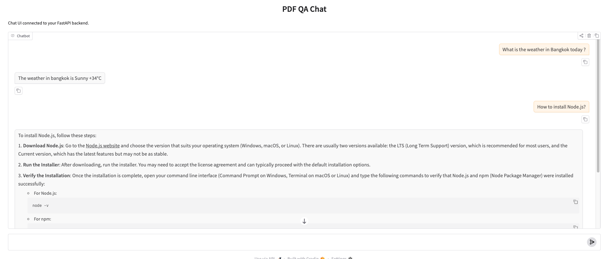
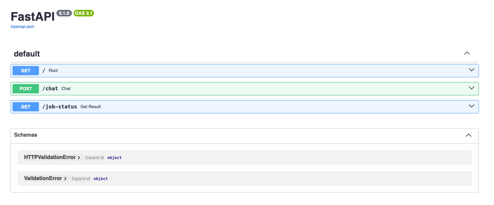

# PDF QA Agent



An AI-powered PDF Question Answering Chat Agent built with Retrieval-Augmented Generation (RAG), LangChain, and LangGraph.
This project focuses on answering questions related to Node.js documentation using advanced retrieval techniques, async worker queues, and tool-based AI routing.

---

## 📘 Example Questions

#### search_pdf

What is the Node.js?
How to install Node.js?

#### get_weather

What is the weather in Bangkok?

---

## 🚀 Features

- 🔍 RAG (Retrieval-Augmented Generation) pipeline using LangChain
- 🧠 Query Expansion for improved semantic search
- 📚 MMR (Max Marginal Relevance) Retrieval for diverse context selection
- 🗂️ Vector Database using Qdrant
- ⚡ Async worker queue architecture using Redis/Valkey + RQ
- 🤖 LangGraph agent workflow
- 🛠️ Tool-based routing system
- 🌦️ Weather tool integration
- 📄 PDF semantic search for Node.js manuals/documentation
- 🧩 FastAPI backend APIs
- 🐳 Docker & Docker Compose support
- ✅ Pydantic request/response validation

---

## 🏗️ System Architecture

```
User Question
      │
      ▼
 FastAPI API Layer
      │
      ▼
 Redis / Valkey Queue
      │
      ▼
 Async Worker (RQ)
      │
      ▼
 LangGraph Agent
 ┌───────────────┐
 │ Router Node   │
 └──────┬────────┘
        │
 ┌──────┴──────────────┐
 │                     │
 ▼                     ▼
Tool Node          LLM Node
 │
 ├── search_pdf
 │      └── RAG Pipeline
 │            ├── Query Expansion
 │            ├── MMR Retrieval
 │            └── Qdrant Vector Search
 │
 └── get_weather
```

## 🧠 AI Workflow

The application uses a LangGraph workflow consisting of:

### 1. Router Node

Determines whether the user query requires:

PDF semantic search
Weather API tool
Normal LLM response generation

### 2. Tool Node

<strong>2.1 search_pdf</strong>

Used when the question is related to <strong>Node.js</strong> documentation/manuals.

Pipeline:
Query Expansion
Embedding Generation
Qdrant Vector Search
MMR Retrieval
Context Generation
LLM Response

<strong>2.2 get_weather</strong>

Fetches weather information using external weather APIs.

### 3. LLM Node

If no tool is required, the LLM generates a normal conversational response.

---

## 🧰 Tech Stack

#### Backend

- Python
- FastAPI
- Pydantic

#### AI / ML

- LangChain
- LangGraph
- OpenAI API

#### Vector Database

- Qdrant

#### Queue System

- Redis / Valkey
- RQ (Redis Queue)

#### Containerization

- Docker
- Docker Compose

---

## 🐳 Docker Setup

#### Build Containers

```
docker compose build
```

#### Start Services

```
docker compose up -d
```

---

## ⚙️ API Endpoints



### GET /

Health check endpoint.

#### Response

```
{
  "status": "Server is up and running"
}
```

### POST /chat

Submit a user question to the async queue.

#### Request

```
{
  "query": "What is event loop in Node.js?"
}
```

### GET /job-status/{job_id}

Retrieve generated AI response from worker queue.

#### Response

```
{
  "status": "finished",
  "result": "The Node.js event loop is..."
}
```

---

## 📦 Services

- FastAPI API Server
- Worker Queue
- Valkey / Redis
- Qdrant Vector Database

---

## 🔄 Async Queue Workflow

```
Client Request
      │
      ▼
FastAPI /chat
      │
      ▼
Redis/Valkey Queue
      │
      ▼
RQ Worker
      │
      ▼
LangGraph Agent Execution
      │
      ▼
Store Result
      │
      ▼
Client polls /job-status
```

---

## 🎯 Key Concepts Implemented

- Retrieval-Augmented Generation (RAG)
- Semantic Search
- Query Expansion
- MMR Retrieval
- Tool Calling
- AI Routing
- Async Processing
- Agentic Workflow
- Vector Similarity Search
- Queue-based AI Architecture

---

### 👨‍💻 Author

Built for experimenting with:

AI Agents
LangGraph
RAG Systems
Async AI Architecture
Production-ready FastAPI services
